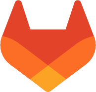

### About me :information_source:
:office: Web/Software developer at [Plejd](https://www.plejd.com/)

### Additional projects :computer:
Most of my public and recent projects can be found in the [`SvanteJonssonITHS` organization](https://github.com/orgs/SvanteJonssonITHS/repositories) as they are related to my newly finished education! 
#### Favorite projects
Some of my favorite projects from my studies are:
- [My graduation project](https://github.com/svantejonssonITHS/examensarbete) which is a journey planner and deparutre board using the SL (Stockholms Lokaltrafik) API
- [Domanda!](https://github.com/svantejonssonITHS/Testing-och-TypeScript-Laboration-1) which is a quiz application developed using TDD. This project also has awesome documentation if you like that kind of stuff 🤩
- [A clock application](https://github.com/svantejonssonITHS/Cross-plattform-utveckling-Laboration-3) for mobile devices developed using React Native

### Contact :postbox:
<a href="https://www.linkedin.com/in/svantejonsson" style="display:flex; align-items: center; gap: 0.5rem;"> LinkedIn</a>

<a href="https://gitlab.com/svantejonsson" style="display:flex; align-items: center; gap: 0.5rem;"> Gitlab</a>
